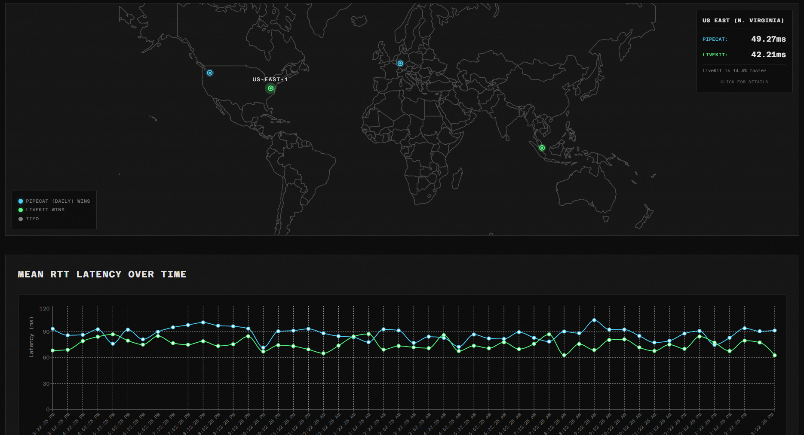

# Voice RTC Benchmark

A distributed benchmarking system for comparing WebRTC voice AI platforms (Daily vs LiveKit) across multiple geographic locations and time periods.


*Dashboard preview showing mock data*

## Overview

This project measures the **network transport baseline latency** of Daily.co and LiveKit by sending ping-pong messages through WebRTC data channels. Results are aggregated in Amazon Timestream for InfluxDB and visualized in a real-time dashboard.

### What You Get

- 🌍 **Distributed Benchmarking**: Deploy runners to multiple locations
- 📊 **Time-Series Data**: Historical metrics stored in Amazon Timestream for InfluxDB
- 📈 **Aggregated Analytics**: Mean, P50, P95, P99, jitter, packet loss over time
- 🎯 **Platform Comparison**: Side-by-side Daily vs LiveKit analysis
- 🎨 **Real-time Dashboard**: Brutalist technical aesthetic with live data
- 🔬 **Reproducible Methodology**: Fair comparison across locations

## Project Structure

```
voice-rtc-bench/
├── packages/
│   ├── echo_agent/            # Python echo agent (Daily + LiveKit)
│   │   ├── src/echo_agent/    # Agent source code
│   │   │   ├── main.py        # Entry point
│   │   │   ├── platforms/     # Platform-specific implementations
│   │   │   └── ...
│   │   └── pyproject.toml
│   ├── benchmark_runner/      # Python CLI for running benchmarks
│   │   ├── src/benchmark_runner/
│   │   │   ├── runners/       # Benchmark clients
│   │   │   ├── main.py        # Entry point
│   │   │   └── ...
│   │   └── pyproject.toml
│   └── shared/                # Shared utilities and types
│       └── pyproject.toml
├── frontend/                  # React dashboard + TypeScript API
│   ├── src/                   # React app (data visualization)
│   ├── server/                # Express API (InfluxDB queries)
│   └── package.json
└── pyproject.toml             # Workspace configuration
```

## Architecture

### Distributed System Flow

```
┌─────────────────────────────────────────────────────────────┐
│       Benchmark Runners (Python CLI - Multi-Region)          │
│                                                              │
│  Location A (us-west-2)    Location B (eu-central-1)        │
│  benchmark-runner CLI      benchmark-runner CLI             │
│         │                          │                         │
│         └──────────┬───────────────┘                         │
│                    │ 1. POST /connect                        │
│                    │ (to specific platform agent)            │
│                    ▼                                         │
├─────────────────────────────────────────────────────────────┤
│            Echo Agents (Cloud - Separate Processes)          │
│                                                              │
│  ┌─────────────────────────┐    ┌─────────────────────────┐  │
│  │ Daily Agent (Port 8000) │    │ LiveKit Agent (Port 8001)│ │
│  │ • POST /connect         │    │ • POST /connect         │  │
│  │ • Creates Daily rooms   │    │ • Creates LiveKit rooms │  │
│  └──────────┬──────────────┘    └──────────┬──────────────┘  │
│             │                          │                     │
│             │ 2. WebRTC Ping-Pong      │                     │
│             ▼                          ▼                     │
│  ┌──────────────────────┐       ┌──────────────────────┐     │
│  │ Daily WebRTC Rooms   │       │ LiveKit WebRTC Rooms │     │
│  └──────────┬───────────┘       └──────────┬───────────┘     │
│             │                          │                     │
│             │ 3. Write results         │                     │
│             ▼                          ▼                     │
│  ┌─────────────────────────────────────────────────────┐     │
│  │          Amazon Timestream for InfluxDB 3           │     │
│  └──────────────────────────┬──────────────────────────┘     │
│                             │ 4. Query metrics               │
│                             ▼                                │
│  ┌─────────────────────────────────────────────────────┐     │
│  │             TypeScript API Server                   │     │
│  └──────────────────────────┬──────────────────────────┘     │
│                             │ 5. Visualize                   │
│                             ▼                                │
│  ┌─────────────────────────────────────────────────────┐     │
│  │                React Dashboard                      │     │
└─────────────────────────────────────────────────────────────┘
```

### How It Works

1. **Echo Agents** run as separate HTTP API servers (one for Daily, one for LiveKit)
2. **Benchmark Runners** (scheduled or manual) call `POST /connect` API endpoint on the respective agent
3. **Echo Agents** create temporary rooms and return credentials
4. **Benchmark Runners** connect to rooms and run ping-pong latency tests (100 pings per run)
5. **Results** are written to Amazon Timestream for InfluxDB with a unique `run_id` per benchmark run
6. **Echo agents automatically leave** the room when the benchmark client disconnects
7. **Rooms auto-expire** after 10 minutes (Daily) or when empty (LiveKit)
8. **Dashboard** queries InfluxDB, aggregates by `run_id`, and visualizes metrics with filters

## Quick Start

### Prerequisites

- **Python 3.11+** with `uv` installed
- **Node.js 18+** with `pnpm` installed
- **Daily account** (free tier works)
- **LiveKit Cloud account** (free tier works)
- **AWS account** with Amazon Timestream for InfluxDB access (for production)

### Step 1: Set Up Platform Accounts

**Daily.co:**
1. Sign up at [daily.co](https://www.daily.co/)
2. Go to [Developers](https://dashboard.daily.co/developers)
3. Get your **API key** (for creating rooms programmatically)

**LiveKit:**
1. Sign up at [livekit.io](https://livekit.io/)
2. Create a project at [cloud.livekit.io](https://cloud.livekit.io)
3. Get your **server URL**: `wss://your-project.livekit.cloud`
4. Generate **API key** and **API secret** from project settings

**Amazon Timestream for InfluxDB (Optional - for production):**
1. Set up AWS account
2. Create an Amazon Timestream for InfluxDB 3 instance in your region
3. Get your InfluxDB endpoint URL from the AWS console
4. Get your authentication token from AWS Secrets Manager
5. Create database/bucket: `voice-rtc-benchmarks`

### Step 2: Start Echo Agents

The echo agents run as separate processes. You can run them in separate terminals.

**Daily Agent (Port 8000):**
```bash
# From root directory
uv run echo-agent --platform daily
```

**LiveKit Agent (Port 8001):**
```bash
# From root directory
uv run echo-agent --platform livekit
```

You should see output indicating the server is running on the respective port.

### Step 3: Run Benchmarks

The benchmark runner automatically requests room credentials from the echo agent and writes results to InfluxDB if configured in `.env`.

**Run Daily benchmark:**

```bash
# From root directory
uv run benchmark-runner \
  --platform daily \
  --agent-url "http://localhost:8000" \
  --iterations 100 \
  --location "us-west-2"
```

**Run LiveKit benchmark:**

```bash
# From root directory
uv run benchmark-runner \
  --platform livekit \
  --agent-url "http://localhost:8001" \
  --iterations 100 \
  --location "us-west-2"
```

**Run both platforms sequentially:**

```bash
# Run Daily first
uv run benchmark-runner --platform daily --agent-url "http://localhost:8000" --location "us-west-2"

# Then run LiveKit
uv run benchmark-runner --platform livekit --agent-url "http://localhost:8001" --location "us-west-2"
```

**Additional options:**

```bash
# Customize iterations, timeout, and cooldown
uv run benchmark-runner \
  --platform daily \
  --agent-url "http://localhost:8000" \
  --iterations 50 \
  --timeout 3000 \
  --cooldown 200 \
  --location "us-west-2"

# Save results to JSON file
uv run benchmark-runner \
  --platform daily \
  --agent-url "http://localhost:8000" \
  --output results.json

# Enable verbose logging
uv run benchmark-runner \
  --platform daily \
  --agent-url "http://localhost:8000" \
  --verbose
```

The benchmark runner will:
1. Request room credentials from the echo agent API
2. Connect to the platform-specific WebRTC room
3. Send 100 ping messages and measure round-trip times
4. Calculate statistics (mean, median, P95, P99, jitter, packet loss)
5. Write individual measurements to InfluxDB with a unique `run_id` (if configured)
6. Echo agent automatically disconnects when the benchmark completes
7. Rooms auto-expire after 10 minutes

### Step 4: View Results in Dashboard

**Terminal 1 - API Server:**
```bash
cd frontend
pnpm install
cp .env.example .env
# Edit .env and add InfluxDB credentials
pnpm dev:server
```

**Terminal 2 - Frontend:**
```bash
cd frontend
pnpm dev
```

Open `http://localhost:5173` in your browser.

The dashboard shows:
- Aggregated metrics from all benchmark runs
- Filters by location, platform, and time range
- Min/max ranges for each metric
- Platform comparison across locations

## Deployment

### Echo Agents

Deploy separate services for Daily and LiveKit agents.

**Fly.io (Daily Agent):**
```bash
cd packages/echo_agent
fly launch --name voice-rtc-daily
fly secrets set DAILY_API_KEY="..."
# Update fly.toml to run: echo-agent --platform daily
fly deploy
```

**Fly.io (LiveKit Agent):**
```bash
cd packages/echo_agent
fly launch --name voice-rtc-livekit
fly secrets set LIVEKIT_URL="..." LIVEKIT_API_KEY="..." LIVEKIT_API_SECRET="..."
# Update fly.toml to run: echo-agent --platform livekit
fly deploy
```

**Railway / Render:**
- Create two services from the same repo.
- Service 1 (Daily): Command `uv run echo-agent --platform daily`
- Service 2 (LiveKit): Command `uv run echo-agent --platform livekit`

### Benchmark Runners

Deploy to multiple locations using:

**AWS Lambda + EventBridge:**
- Package `benchmark-runner/` as Lambda function
- Trigger on schedule (e.g., hourly)
- Set `LOCATION_ID` per region

**Cron Jobs:**
```bash
# Run Daily benchmark every hour
0 * * * * cd /path/to/voice-rtc-bench && uv run benchmark-runner --platform daily --agent-url "https://your-daily-agent.fly.dev" --location "us-west-2"

# Run LiveKit benchmark every hour (offset by 30 minutes)
30 * * * * cd /path/to/voice-rtc-bench && uv run benchmark-runner --platform livekit --agent-url "https://your-livekit-agent.fly.dev" --location "us-west-2"
```

**Docker:**
```dockerfile
FROM python:3.11-slim
WORKDIR /app
COPY . .
RUN pip install uv && uv sync --all-packages

# Run benchmark on container start
CMD ["uv", "run", "benchmark-runner", "--platform", "daily", "--agent-url", "http://daily-agent:8000", "--location", "us-west-2"]
```

### Frontend + API

**Vercel / Netlify:**
- Deploy frontend as static site
- Deploy API as serverless functions

**Single Server:**
```bash
cd frontend
pnpm build
pnpm build:api
# Serve dist/ with nginx
# Run API server: node dist/server/index.js
```

## Tech Stack

| Component        | Technology                                            |
| ---------------- | ----------------------------------------------------- |
| Echo Agent       | Python 3.11+ with `daily-python` and `livekit-agents` |
| Benchmark Runner | Python with `typer`, `pydantic`, `influxdb3-python`   |
| API Server       | TypeScript + Express + InfluxDB 3 Client              |
| Frontend         | React 19 + TypeScript + Vite                          |
| Styling          | Custom CSS with brutalist aesthetic                   |
| Time-Series DB   | Amazon Timestream for InfluxDB 3                      |
| Type Checking    | `ty` (Python), `tsc` (TypeScript)                     |
| Linting          | `ruff` (Python), `biome` (TypeScript)                 |
| Package Managers | `uv` (Python), `pnpm` (Node.js)                       |

## What This Measures

- **Round-Trip Time (RTT)**: Client → Server → Client latency
- **Jitter**: Variation in consecutive message latencies
- **Packet Loss**: Percentage of timed-out messages
- **Percentiles**: P50 (median), P95, P99 distributions

**Important Note**: This measures the network "speed limit". Actual voice AI latency will be higher due to:
- Audio codec overhead (5-20ms)
- Jitter buffers (20-200ms)
- STT/LLM/TTS processing time (100-1000ms+)

This provides the **infrastructure baseline** for voice AI applications.

### Data Model & Storage

Each benchmark run generates:
- **100 individual ping measurements** (configurable via `--iterations`)
- Each measurement is written to InfluxDB with a shared `run_id` tag
- All measurements from a single run share the same `run_id` (UUID)

**InfluxDB Schema:**
```
Measurement: latency_measurements
Tags: platform, location_id, run_id
Fields: round_trip_time, client_to_server, server_to_client, message_number
Time: measurement timestamp
```

**Time-Series Visualization:**
- The dashboard aggregates measurements by `run_id`
- Each data point on the graph = average of ~100 pings from a single benchmark run
- This provides clean, meaningful trends over time rather than showing individual pings

**Example:** Running 10 benchmarks creates:
- 1000 individual measurements in InfluxDB (10 runs × 100 pings)
- 10 data points in the time-series chart (1 per run, averaged)

## Results Interpretation

### What Makes a Good Result?

- **Mean RTT < 100ms**: Excellent for voice AI
- **P99 RTT < 200ms**: Consistent, low-jitter performance
- **Packet Loss < 1%**: Reliable transport
- **Jitter < 20ms**: Smooth, predictable latency

### Comparing Platforms

The dashboard shows which platform has lower latency for each metric across locations. Lower is better for RTT, jitter, and packet loss.

**Remember**: This is the baseline. Add 100-300ms for typical voice AI processing overhead.

## CLI Reference

### Benchmark Runner

```bash
# Run from root directory
uv run benchmark-runner \
  --platform {daily,livekit} \  # Platform to benchmark (required)
  --agent-url URL \             # Echo agent API URL (required)
  --iterations N \              # Number of pings (default: 100 or from .env)
  --timeout MS \                # Timeout in ms (default: 5000 or from .env)
  --cooldown MS \               # Cooldown between pings in ms (default: 100 or from .env)
  --location ID \               # Location identifier (default: from .env)
  --output FILE \               # Save JSON results to file (optional)
  --verbose                     # Enable debug logging (optional)
```

**Configuration:**
- InfluxDB settings (URL, token, org, database) are configured via `.env` file only
- Platform credentials (Daily API key, LiveKit credentials) are configured in `.env`
- CLI flags override `.env` values for iterations, timeout, cooldown, and location

**Examples:**

```bash
# Basic benchmark with defaults from .env
uv run benchmark-runner --platform daily --agent-url "http://localhost:8000"

# Override iterations and location
uv run benchmark-runner \
  --platform livekit \
  --agent-url "http://localhost:8001" \
  --iterations 50 \
  --location "eu-central-1"

# Save results to file with verbose logging
uv run benchmark-runner \
  --platform daily \
  --agent-url "http://localhost:8000" \
  --output results.json \
  --verbose
```

## API Reference

### GET /api/results/aggregated

Get aggregated statistics over time period.

**Query Parameters:**
- `platform` - Filter by platform: `daily` or `livekit` (optional)
- `location` - Filter by location ID (optional)
- `hours` - Hours to look back (default: 24)

**Response:**
```json
{
  "data": [
    {
      "platform": "daily",
      "location_id": "us-west-2",
      "metric_name": "mean_rtt",
      "avg_value": 45.23,
      "min_value": 42.18,
      "max_value": 52.34,
      "sample_count": 24,
      "time_period": "2025-11-19T10:00:00Z"
    }
  ]
}
```

### GET /api/results/timeseries

Get time-series data for a specific metric.

**Query Parameters:**
- `metric` - Metric name (required): `mean_rtt`, `p95_rtt`, `p99_rtt`, `jitter`, `packet_loss_rate`
- `platform` - Filter by platform (optional)
- `location` - Filter by location ID (optional)
- `hours` - Hours to look back (default: 24)

### GET /api/results/locations

Get list of unique locations.

**Response:**
```json
{
  "data": ["us-west-2", "eu-central-1", "ap-southeast-1"]
}
```

### GET /api/results/latest

Get latest statistics for all locations and platforms.

## Development

### Code Quality

All projects use linting and type checking:

**Python (from root directory):**
```bash
uv run ruff check --fix     # Lint and fix
uv run ruff format          # Format
uv run ty check             # Type check
```

**TypeScript (frontend):**
```bash
pnpm check                # Lint + type check
pnpm lint                 # Biome linting
pnpm typecheck            # TypeScript checking
```

### Project Configuration

All Python projects use:
- **ruff** for linting and formatting (line length: 100)
- **ty** for type checking
- **uv** for dependency management

Frontend uses:
- **biome** for linting and formatting
- **TypeScript** for type checking
- **pnpm** for dependency management

## Design Philosophy

The dashboard embraces a **"Technical Performance Lab"** aesthetic:

- **Brutalist minimalism** with precision focus
- **Monospace typography** (Azeret Mono) for technical authenticity
- **Platform-specific colors**: Cyan (#00d4ff) for Daily, Lime (#00ff88) for LiveKit
- **Scan-line effects** and noise texture for "monitoring equipment" feel
- **Time-series data visualization** with location filtering
- **No-nonsense information hierarchy**

## Future Enhancements

- **Audio loopback testing**: Measure actual audio path latency (beyond data channels)
- **Full STT→LLM→TTS pipeline**: End-to-end voice AI latency
- **Network condition simulation**: Test under various network conditions
- **Additional platforms**: Add support for Agora, Twilio, etc.
- **Advanced analytics**: Correlation analysis, anomaly detection
- **Alerting**: Slack/email notifications for degraded performance

## Contributing

Contributions welcome! This is an open-source benchmarking tool for the voice AI community.

## License

MIT